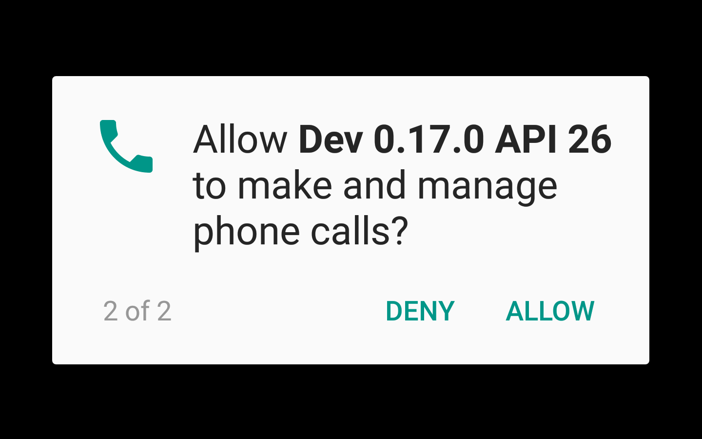
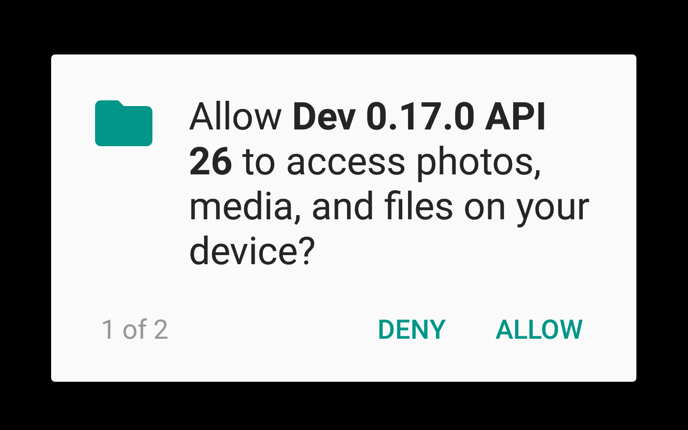

Scary Android Permissions
=========================
If you have recently updated Unity, you may notice that your game is now asking for Android permissions that you never requested.

Woah, what!?

Make it Stop
------------
.. highlight:: xml

The "make and manage phone calls" permission is the ``READ_PHONE_STATE`` permission. To remove this, what we are going to do is modify the ``<uses-permission>`` to only request it for Android version 1. Which is another way of saying, "Never ask for this."

Add this to your ``AndroidManifest.xml`` ::

    <uses-permission android:name="android.permission.READ_PHONE_STATE" android:maxSdkVersion="1" />

The other permission is the ``WRITE_EXTERNAL_STORAGE`` permission.

Can be suppressed by adding this to your ``AndroidManifest.xml`` inside your main ``<activity>`` ::

    <meta-data android:name="unityplayer.SkipPermissionsDialog" android:value="true" />

.. note:: If your game **does** require this permission, you will need to request it later in order to use it.
    
    We suggest only asking for permissions when the user initiates an action that would require the permission. If you need help with this, contact us.